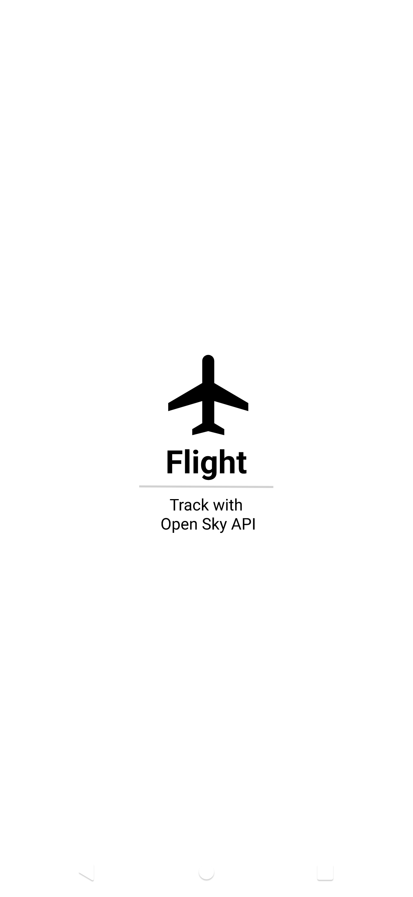
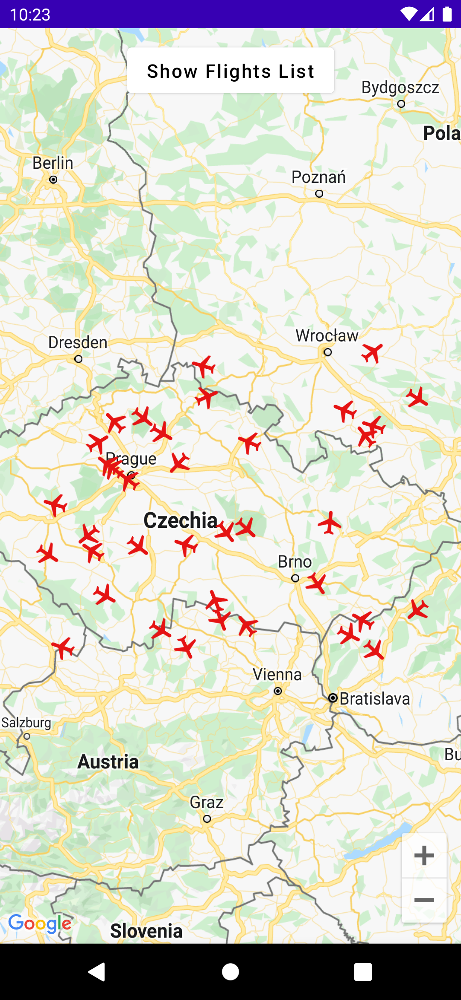
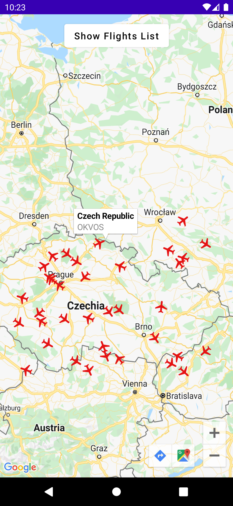
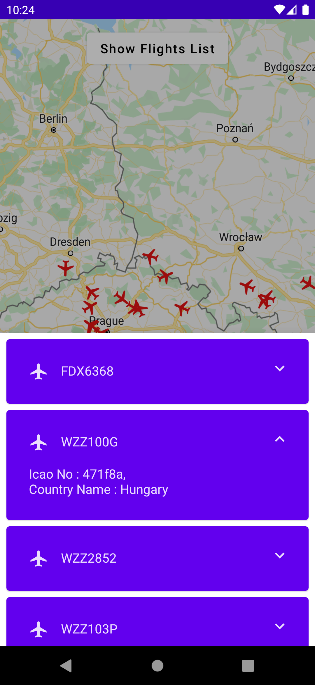
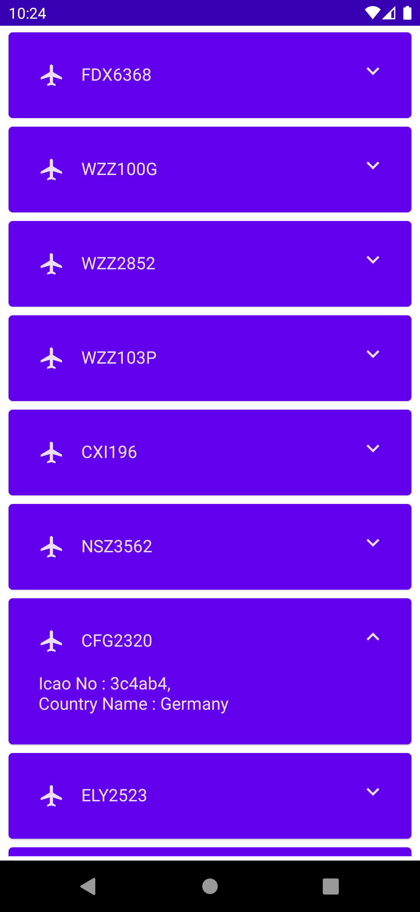
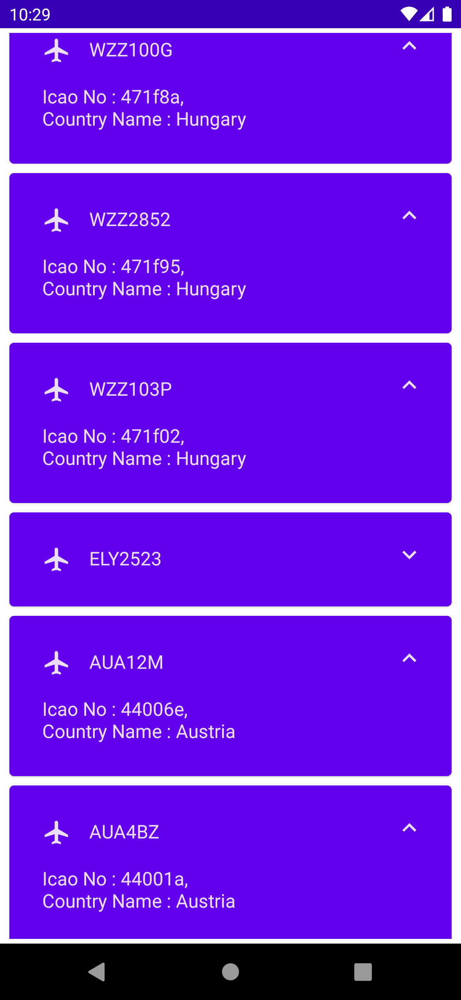

# OpenSky API - Android Jetpack Compose

    

A demonstration modern Android development project with Jetpack(Compose, Room, ViewModel, Navigation), Hilt and based on MVVM by using Open Sky API.

## ℹ Introduction

It is about a demonstration application with Open Sky API. You get flight information from Open Sky API service, then update and display them every 10 seconds.

## What You Will Need

**Hardware Requirements**
- A computer that can run Android Studio.
- An Android phone for debugging.

**Software Requirements**
- Android SDK package
- Android Studio 4.X

## 🛠 Features

- Show flights on map
- Show flights information on list

## 📱 Screenshots

<p align="center">
  
  
  
</p>

<p align="center">
  
  
  
</p>

## 📲 Download

Go to the [Releases](https://github.com/isoguzay/OpenSkyAPICompose/releases) to download the latest APK.

## 🏗 Tech Stack

### Architecture

- 100% Kotlin based, including Gradle files
- MVVM Clean & Multi-Module Architecture
- Repository Pattern

### Libraries

- Minimum SDK level 21 + based on [Kotlin](https://kotlinlang.org/)

- buildSrc + Kotlin DSL - Manage dependencies and modules implementation easily and much clearer than the traditional way

- [Coroutines](https://github.com/Kotlin/kotlinx.coroutines) & [Flow](https://kotlin.github.io/kotlinx.coroutines/kotlinx-coroutines-core/kotlinx.coroutines.flow/) - Perform asynchronous operations

- [Hilt](https://dagger.dev/hilt/) - for dependency injection

- Jetpack Libraries
    - [Compose](https://developer.android.com/jetpack/compose/documentation) - Build modern declarative Android UI
    - [Compose Navigation](https://developer.android.com/jetpack/compose/navigation) - Navigate between composables
    - [Lifecycle](https://developer.android.com/jetpack/compose/lifecycle) - Observe lifecycle state changes
    - [Room](https://developer.android.com/training/data-storage/room) - Manage CRUD operations
    - [ViewModel](https://developer.android.com/topic/libraries/architecture/viewmodel) - Store UI related data

- [Retrofit Client](https://square.github.io/retrofit/) - Execute network service calls
- [Splash API](https://developer.android.com/guide/topics/ui/splash-screen) - Customize your Splash without effort
- [Timber](https://github.com/JakeWharton/timber) - Log your messages

### Services

- [Open SKY API Service](https://openskynetwork.github.io/opensky-api/rest.html) - Open Sky API
- [Google Maps Compose](https://developers.google.com/maps/documentation/android-sdk/maps-compose) - Google Maps with Jetpack Compose

## How to get the Google MAPS API key?

Register [here](https://developers.google.com/maps/documentation/android-sdk/maps-compose) and get your own API key for your builds.

## ❤️ Find this repository useful?

Support the repository by becoming a __[stargazer](https://github.com/isoguzay/OpenSkyAPICompose/stargazers)__ 🌟 </br>

## License

```xml
Designed and developed by isoguzay (Ismail Oguzhan Ay)

    Licensed under the Apache License, Version 2.0 (the "License");
    you may not use this file except in compliance with the License.
    You may obtain a copy of the License at

    http://www.apache.org/licenses/LICENSE-2.0

    Unless required by applicable law or agreed to in writing, software
    distributed under the License is distributed on an "AS IS" BASIS,
    WITHOUT WARRANTIES OR CONDITIONS OF ANY KIND, either express or implied.
    See the License for the specific language governing permissions and
    limitations under the License.
```

